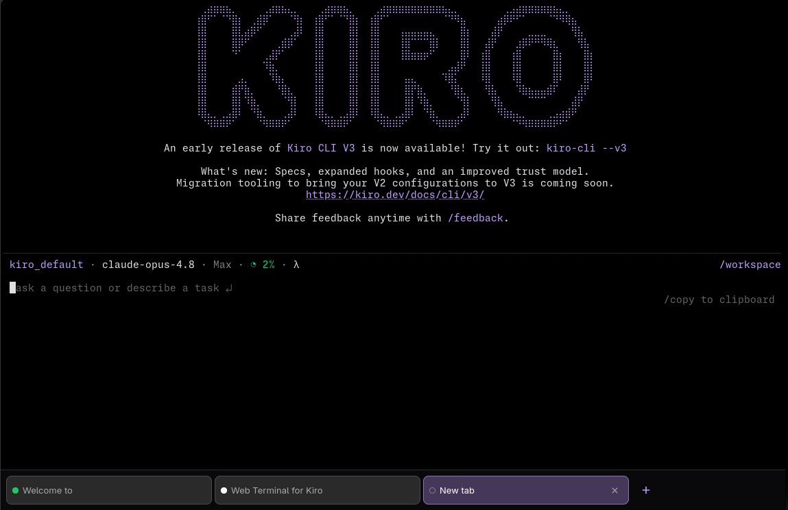

# Web Terminal for Kiro

[](https://github.com/cplieger/web-terminal-kiro/pkgs/container/web-terminal-kiro)


[](https://github.com/cplieger/web-terminal-kiro/actions/workflows/coverage.yml)
[](https://github.com/cplieger/web-terminal-kiro/issues?q=label%3Agremlins-tracker)
[](https://www.bestpractices.dev/projects/13542)
[](https://scorecard.dev/viewer/?uri=github.com/cplieger/web-terminal-kiro)
[](https://github.com/cplieger/web-terminal-kiro/releases)

A minimal browser terminal for the **Kiro CLI**: run `kiro-cli` in a browser tab, on your desktop or your phone.



Web Terminal for Kiro gives each browser tab its own `kiro-cli` session over a live PTY stream and renders kiro-cli's real terminal UI verbatim, the way an SSH session would, with no chat layer, history store, or translation in between.

What sets it apart from a typical browser terminal: the screen is **real browser text, not a canvas**, so scrolling and text selection are native; it is **touch-first with multiple tabs**, as usable on a phone as on a laptop; and sessions **survive sleep and network drops**: the screen and scrollback are replayed on reconnect, so you never lose your place.

Published as a multi-arch (amd64 + arm64) container image on **GHCR** (`ghcr.io/cplieger/web-terminal-kiro`) and **Docker Hub** (`cplieger/web-terminal-kiro`).

## ⚠️ It is a remote shell

A browser tab here is an interactive shell with access to your files under `/workspace` and to kiro-cli's stored credentials. Anyone who can reach the port can use it, and Web Terminal for Kiro has **no built-in authentication**. Before exposing it beyond your own machine, do one (ideally both) of:

- put it behind an authenticating reverse proxy (Caddy forward-auth, oauth2-proxy, Authentik, …), and/or
- keep the published port on loopback or a private network.

The server logs a warning at startup when it binds a non-loopback address.

## Run

```yaml
# compose.yaml
services:
  web-terminal-kiro:
    image: ghcr.io/cplieger/web-terminal-kiro:latest
    ports:
      - "9848:9848"
    volumes:
      - ./config:/config        # kiro-cli auth, tools, settings
      - ./workspace:/workspace  # your repos
    restart: unless-stopped
```

Open <http://localhost:9848>. On first launch, kiro-cli walks you through sign-in with a device-code flow: it prints a URL and a one-time code, so you open the URL in any browser (your phone works), enter the code, and you're in. Every browser tab is a fresh session.

Web Terminal for Kiro runs as root so `git`, `gh`, and SSH work; don't add a `user:` line, and expect files under the mounts to be root-owned on the host.

## Configuration

The image ships working defaults; most setups only pick a port and a volume.

| Variable | Default | Purpose |
| --- | --- | --- |
| `KWEB_ADDR` | `:9848` | Listen address (`host:port`). |
| `KWEB_WORK_DIR` | `/workspace` | Directory each terminal session starts in (must exist). |
| `TRUSTED_PROXIES` | _(unset)_ | Reverse-proxy CIDRs / bare IPs whose `X-Forwarded-For` the access log trusts to resolve `client_ip`. See [Behind a reverse proxy](#behind-a-reverse-proxy). |

- **Port:** `9848` (HTTP + WebSocket).
- **Volumes:** `/config` persists kiro-cli auth/tokens, installed tools, settings, and `~/.ssh` + git config; `/workspace` is your repositories / working directory.
- **Health:** the image's healthcheck reports healthy only once the server is up **and** kiro-cli is installed and runnable, so a failed first-boot install shows as `unhealthy` in `docker ps` instead of a terminal that silently errors.

kiro-cli itself is pinned and downloaded on first boot (it is not redistributed inside the image); newer versions arrive by pulling a newer image tag.

### kiro-cli settings and MCP servers

Everything kiro-cli stores lives under `/config` and survives container recreation, so your sign-in, settings, and installed tools stick around. To add [MCP](https://modelcontextprotocol.io) servers, edit kiro-cli's own config on the volume at `/config/home/.kiro/settings/mcp.json`, or run `docker exec -it web-terminal-kiro kiro-cli mcp add --scope global <name> ...`. Use global scope (the per-workspace default only applies under `/workspace`) so the server loads in every session, then open a new tab, since kiro-cli reads its MCP config at session start.

### Behind a reverse proxy

Web Terminal for Kiro has no built-in authentication, so the cleanest way to expose it is to let a reverse proxy terminate TLS and require a login. A minimal [Caddy](https://caddyserver.com) config adds HTTP Basic auth in front of the terminal:

```caddyfile
webterm.example.com {
    basic_auth {
        # generate the hash with: caddy hash-password
        alice $2a$14$...
    }
    reverse_proxy 127.0.0.1:9848
}
```

For real single sign-on, use forward auth (Authentik, oauth2-proxy) instead of Basic auth; Caddy proxies the terminal's WebSocket transparently either way. Pair this with a published port bound to loopback (`127.0.0.1:9848:9848`) so the only route in is through the proxy.

Behind a proxy, also set `TRUSTED_PROXIES` so the access log records the real client. By default (`TRUSTED_PROXIES` unset) the log uses the direct socket peer and ignores any `X-Forwarded-For` header, so the logged IP cannot be spoofed; that's the correct choice when Web Terminal for Kiro is directly exposed. When a proxy sits in front, the socket peer is the proxy, not the user, so set `TRUSTED_PROXIES` to the proxy's address(es), a comma-separated list of CIDRs or bare IPs (e.g. `TRUSTED_PROXIES=10.0.0.0/8,192.0.2.10`); the log then resolves the real client from a trusted `X-Forwarded-For`. Only a request whose socket peer is inside the set has its `X-Forwarded-For` trusted (spoof-safe); a malformed entry is logged and skipped rather than aborting startup.

## Features

Everything below works on a phone as well as a desktop.

**A faithful terminal**, powered by [web-terminal-engine](https://github.com/cplieger/web-terminal-engine):

- Full 16 / 256 / 24-bit truecolor and every text attribute (bold, italic, underline, reverse, strikethrough, …), box-drawing, and wide CJK characters.
- Mouse support and clickable **OSC 8 hyperlinks** (bare URLs are auto-linked too).
- Desktop **notifications** and **progress** indicators (OSC 9 / OSC 9;4).
- Full-screen apps (`vim`, `htop`, `less`, `man`) run on the alternate screen, with your scrollback restored on exit.
- Bracketed paste, selectable cursor styles, the Kitty keyboard protocol, and clipboard writes from CLI apps (OSC 52).

**Made for touch**, via the [web-terminal-ui](https://github.com/cplieger/web-terminal-ui) front end:

- **Multiple tabs**: open, close, drag to reorder, plus a swipeable mobile tab switcher.
- An on-screen **key toolbar** (Tab, Esc, arrows, Enter, and a sticky-Ctrl modifier) for keys a phone keyboard lacks.
- Native **text selection**, copy/paste, and a **long-press / right-click context menu**.
- **Predictive echo** so typing feels instant over slow links, tap-to-focus, and a scroll-to-bottom control with auto-follow.
- **Per-tab status dots**: see at a glance which session is working, done, or waiting for input.
- IME/composition support, keyboard accessibility, theming, and reduced-motion support.

**Resilient by default:**

- Auto-reconnect with screen + scrollback replay after laptop sleep, network drops, or proxy timeouts.
- Input sent during an outage is re-delivered on reconnect (no lost or duplicated output), and a restarted server is detected and cleanly resynced.

## Works with the whole kiro-cli TUI

Because Web Terminal for Kiro drives kiro-cli's own terminal UI directly, every kiro-cli feature works with no extra setup, including queue steering (`Ctrl+S`), goal-driven runs (`/goal`), and turn rewind (`/rewind`). On a phone, the shortcuts that need modifier keys are reachable through the on-screen toolbar (sticky-Ctrl, then the letter).

## Tools

Web Terminal for Kiro ships kiro-cli, `git`, and base utilities. Everything else is
declared in `/config/tools.json` — a small manifest the built-in tools engine
(the [`toolbelt`](https://github.com/cplieger/toolbelt) library) reconciles against
on boot: enabled entries are installed into `/config/tools/` (persisting across
restarts), disabled entries wait as templates, removed installs are cleaned up.
There is no management UI; you edit the manifest and restart, or drive the
loopback API from inside a session.

**Enable a bundled template.** First boot seeds language-server templates plus
the GitHub CLI, all disabled. Flip the ones you want and restart:

```jsonc
{
  "version": 2,
  "tools": {
    "gopls":                      { "disabled": true },   // Go — set false to install (pulls the Go toolchain)
    "typescript-language-server": { "disabled": false },  // TypeScript LSP: enabled, installs on restart (pulls node)
    "pyright":                    { "disabled": true },   // Python LSP
    "gh":                         { "disabled": true }    // GitHub CLI
  }
}
```

Install knowledge (download URLs, checksums, dependencies) comes from a
catalog of ~700 tools compiled into the image from the mise and aqua registries —
a template carries no install commands, so it never goes stale. Dependencies
auto-adopt: enabling `typescript-language-server` installs `node` and the
`typescript` package with it, no extra manifest entries needed. Language servers
are picked up by kiro-cli's code intelligence automatically; the boot log warns
when none is enabled. While tools install, the web UI and health endpoint stay
reachable and only new-session creation waits, so the first session always sees
the finished PATH.

**Add more tools by name.** Any catalog name works as a bare entry — the engine
fills in the rest:

```jsonc
"tools": {
  "ripgrep": {},                            // installed at the latest version, then auto-updated
  "shellcheck": { "pin": true },            // pinned: installed once, never auto-bumped
  "jq-custom": {                            // full manual escape hatch
    "source": "manual",
    "version": "1.8.1",
    "install": "curl -fsSL -o ${BIN}/jq https://github.com/jqlang/jq/releases/download/jq-${VERSION}/jq-linux-${ARCH_AMD64_OR_ARM64} && chmod 755 ${BIN}/jq"
  }
}
```

Sources cover `aqua:owner/repo` binaries (checksum-verified when upstream
publishes checksums), `npm:`, `pip:`, `cargo:`, `go:` modules, and `manual`
shell commands with `${VERSION}`/`${BIN}`/`${ARCH_*}` placeholders.

**From inside a session** (agents included), the same engine answers on
loopback only:

```bash
curl -s localhost:9848/api/tools | jq '.tools[] | {name, installed}'
curl -s -X PATCH localhost:9848/api/tools/gopls -d '{"disabled": false}'   # enable + install
curl -s -X POST  localhost:9848/api/tools -d '{"name": "ripgrep"}'         # add from the catalog
```

OS packages are not manifest entries: set `APT_PACKAGES="gcc python3 ..."` on
the container and the entrypoint installs them at each start.

## How it fits together

```text
kiro-cli chat                          one PTY-backed process per browser tab
   │  PTY
web-terminal-engine (Go)               PTY bridge + VT screen buffer + wire protocol
   │  via terminal.NewSessionManager
web-terminal-kiro server (this app)    HTTP + WebSocket, the kiro-cli install, access log
   │  binary wire protocol over WebSocket
web-terminal-engine + web-terminal-ui  renderer + touch UI, running in your browser
```

Web Terminal for Kiro is deliberately small: an HTTP + WebSocket server around the engine, the kiro-cli install, and a structured access log. Everything terminal-related lives in the shared web-terminal libraries.

## Related projects

- [vibekit](https://github.com/cplieger/vibekit): the sister app, a chat-first Kiro web UI (chat history, MCP, agent tools) instead of a raw terminal.
- [web-terminal-engine](https://github.com/cplieger/web-terminal-engine): the terminal engine (Go PTY/VT + TypeScript renderer) behind this app.
- [web-terminal-ui](https://github.com/cplieger/web-terminal-ui): the touch-first browser UI.
- [web-terminal-server](https://github.com/cplieger/web-terminal-server): a generic browser terminal for any command, built on the same engine.

## Contributing

Build, test, and layout notes are in [CONTRIBUTING.md](CONTRIBUTING.md).

## Disclaimer

This project is built with care and follows security best practices, but it is intended for personal / self-hosted use. No guarantees of fitness for production environments. Use at your own risk.

This project was built with AI-assisted tooling using [Claude Opus](https://www.anthropic.com/claude) and [Kiro](https://kiro.dev). The human maintainer defines architecture, supervises implementation, and makes all final decisions.

## License

GPL-3.0. See [LICENSE](LICENSE).
