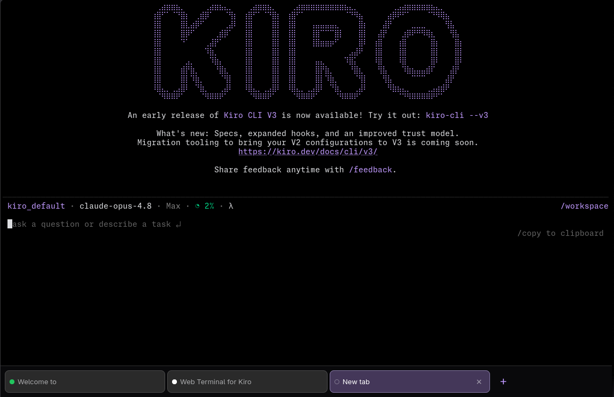

# Web Terminal for Kiro

[](https://github.com/cplieger/web-terminal-kiro/pkgs/container/web-terminal-kiro)


[](https://github.com/cplieger/web-terminal-kiro/actions/workflows/coverage.yml)
[](https://github.com/cplieger/web-terminal-kiro/issues?q=label%3Agremlins-tracker)
[](https://www.bestpractices.dev/projects/13542)
[](https://scorecard.dev/viewer/?uri=github.com/cplieger/web-terminal-kiro)
[](https://github.com/cplieger/web-terminal-kiro/releases)

<!-- hub-overview BEGIN -->
A minimal browser terminal for the **Kiro CLI**: run `kiro-cli` in a browser tab, on your desktop or your phone.



Web Terminal for Kiro gives each browser tab its own `kiro-cli` session over a live PTY stream and renders kiro-cli's real terminal UI verbatim, the way an SSH session would, with no chat layer, history store, or translation in between.

It differs from a typical browser terminal in three ways. The screen is **real browser text**, so scrolling and text selection are native. It is **touch-first with multiple tabs**, as usable on a phone as on a laptop. Sessions **survive sleep and network drops**: the screen and scrollback are replayed on reconnect.

Published as a multi-arch (amd64 + arm64) container image on **GHCR** (`ghcr.io/cplieger/web-terminal-kiro`) and **Docker Hub** (`cplieger/web-terminal-kiro`).

## ⚠️ It is a remote shell

A browser tab here is an interactive shell with access to your files under `/workspace` and to kiro-cli's stored credentials. Anyone who can reach the port can use it, and Web Terminal for Kiro has **no built-in authentication**. Before exposing it beyond your own machine, do one (ideally both) of:

- put it behind an authenticating reverse proxy (Caddy forward-auth, oauth2-proxy, Authentik, …), and/or
- keep the published port on loopback or a private network.

Neither of those covers DNS rebinding: a malicious page in your own browser can point its own hostname at `127.0.0.1` (or your LAN IP) and drive even a loopback-bound terminal, because the request then arrives from your own machine with a matching `Origin`. Also set [`ALLOWED_HOSTS`](#configuration-reference) to the exact hostnames you reach it by; the `Host` allowlist is the check that rejects a rebound request.

The server logs a warning at startup when it binds a non-loopback address, and another when `ALLOWED_HOSTS` is unset.

### Stored scrollback

Each tab's newest 200 lines are kept in your browser's `localStorage`, so returning to a page your phone discarded does not pull every tab's history back over the wire. Terminal output is not always something you want on disk, so know what that keeps:

- It is readable from that browser without reaching this server, and it outlives the tab. An entry is deleted when you close its terminal, and otherwise after seven days.
- Nothing is sent anywhere. The server neither receives nor reads these snapshots.
- Restored output is cleared when it came from a previous run of the container, so a restart never leaves last run's history on screen.
- On a shared or borrowed device, use a private window, which keeps no storage at all.

No setting turns this off.
<!-- hub-overview END -->

## Run

```yaml
# compose.yaml
services:
  web-terminal-kiro:
    image: ghcr.io/cplieger/web-terminal-kiro:latest
    container_name: web-terminal-kiro
    init: true                  # required: reaps orphaned processes, see below
    ports:
      - "9848:9848"
    volumes:
      - ./config:/config        # kiro-cli auth, tools, settings
      - ./workspace:/workspace  # your repos
    restart: unless-stopped
```

Open <http://localhost:9848>. On first launch, kiro-cli signs you in with a device-code flow: it prints a URL and a one-time code, so you open the URL in any browser (your phone works) and enter the code. Every browser tab is a fresh session.

`init: true` is required. An agent session forks language servers, `git` processes and node runtimes whose own parent exits, which re-parents them onto PID 1, and the server waits only for the children it started itself. Without an init the server _is_ PID 1 and those orphans accumulate as zombies for the container's life. The server logs a warning at startup when it finds itself running as PID 1, so a deployment that omits this does not fail silently.

Web Terminal for Kiro runs as root so `git`, `gh`, and SSH work; do not add a `user:` line, and expect files under the mounts to be root-owned on the host.

`/config` must be on a filesystem that permits execution. kiro-cli and every tool the container installs live there and are run from there, so a `noexec` mount fails the install; the startup log reports that in one line naming the path, instead of leaving you with a permission error against a temporary path.

## Configuration reference

The image ships working defaults; most setups only pick a port and a volume.

| Variable | Description | Default |
| --- | --- | --- |
| `LISTEN_ADDR` | Listen address (`host:port`). Leave the host part empty, or use `0.0.0.0`, so the bind still covers loopback: the image's healthcheck probes `127.0.0.1` on the port taken from this value, so a bind pinned to one non-loopback interface reports the container `unhealthy` while it serves normally. Restrict reachability with the published port (`127.0.0.1:9848:9848`) or a reverse proxy instead. | `:9848` |
| `LOG_LEVEL` | Log verbosity: `debug`, `info`, `warn`, or `error` (case-insensitive); `debug` surfaces session-status diagnostics. An unparseable value falls back to `info` with a startup warning. | `info` |
| `LOG_OSC_TEXT` | Log the text of terminal notifications the server does not recognize (needs `LOG_LEVEL=debug` to be visible). Off by default because any program running in the terminal can emit that text, so it can carry a token, a device code, or a tokenised URL. Off, the log still records a per-wording fingerprint and a length. Turn it on only for an active diagnostic session; it warns at startup while set. | `false` |
| `WORK_DIR` | Directory each terminal session starts in (must exist). | `/workspace` |
| `SCROLLBACK` | Lines of history the server retains per terminal: how far back you can scroll, and what a reconnect replays. Held in memory and grown as history is produced, so a large value costs nothing until a session reaches it. kiro-cli clears the retained history on every full-viewport repaint, so a session keeps roughly 3000 lines whatever you set here, and raising it gains nothing. `0` keeps nothing beyond the live screen, and a value between `1` and `2000` is raised to `2001` with a warning, because below the depth a reconnect replays in full the browser falls back to holding its whole buffer. This is the terminal engine's own variable, shared verbatim with every app built on it. | `100000` |
| `KIRO_CLI_CHAT_ARGS` | Extra launch flags appended to every session's `kiro-cli chat` command, whitespace-separated (for example `--effort high` or `--v3`). Flag values never reach the logs; the startup line records only a flag count. | _(unset)_ |
| `TOOL_CATALOG_REFRESH` | How often the server refreshes the tool catalog from the published artifact (Go duration). `off` or `0` disables the schedule; a manual refresh stays available via `POST /api/tools/catalog/refresh` on loopback. | `24h` |
| `TOOL_CATALOG_URL` | Where catalog refreshes fetch from. Point it at a fork or mirror to decouple from the default publisher. | the [tool-catalog](https://github.com/cplieger/tool-catalog) latest-release artifact |
| `TOOL_CATALOG_PATH` | Image-baked tool catalog used at first boot and when offline, until a successfully fetched catalog replaces it. | `/app/tool-catalog.json` |
| `BUNDLED_TOOLS_PATH` | Image-internal file naming the tools this image bundles — the four language servers the seeded manifest lists, which no registry carries — merged over every loaded catalog. | `/app/bundled-tools.json` |
| `TRUSTED_PROXIES` | Reverse-proxy CIDRs / bare IPs whose `X-Forwarded-For` the access log trusts to resolve `client_ip`. See [Behind a reverse proxy](#behind-a-reverse-proxy). | _(unset)_ |
| `ALLOWED_HOSTS` | Comma-separated exact hostnames/IPs the server answers for (for example `localhost,192.168.1.5,webterm.example.com`); any other `Host` header is rejected. Set it for any long-running deployment: it is the check that rejects a DNS-rebinding request, per the security warning above. Unset accepts every `Host` and logs a startup warning. Requests that are loopback on both ends (a loopback client address _and_ a loopback `Host`, such as `127.0.0.1:9848` or `localhost:9848`) are always admitted, so the healthcheck and in-container tools clients keep working; addressing the container by any other name still needs that name in the list. | _(unset)_ |
| `TRUSTED_INSTALL_UIDS` | Comma-separated numeric uids that may have write access to the kiro-cli install tree under `/config/tools` without the server treating the install as compromised. Before installing, the server checks who can write each directory on the way to that tree and refuses when another identity can, because what lands there is later run as root. Unset (the default) makes no exception, and that is the right setting for almost every deployment. Set it only when the check refuses a volume you know is safe. Each uid you list asserts that the account is already at least as privileged as this server, so its write access gains it nothing; listing an unprivileged account hands that account a way in and defeats the check. An entry that is not a whole number above `0` is skipped with a warning that names the variable and how many entries were dropped, never their content. | _(unset)_ |

- **Port:** `9848` (HTTP + WebSocket).
- **Volumes:** `/config` persists kiro-cli auth/tokens, installed tools, settings, and `~/.ssh` + git config; `/workspace` is your repositories / working directory.

kiro-cli itself is pinned and downloaded on first boot; it is not redistributed inside the image, and newer versions arrive by pulling a newer image tag. The download runs after the server starts listening, so the web UI and `/api/health` answer immediately while it happens: new terminals report `503 {"reason":"kiro-cli installing"}` until the install finishes, and the reason names the stage if something goes wrong.

If an install fails for good (no network on first boot, a full volume), the container stays up and repairable: fix or clear `/config/tools/kiro-cli-versions` inside the container, then either restart it or run `curl -X POST localhost:9848/api/kiro-cli/rescan` from inside to make the repair take effect without a restart. That endpoint is loopback-only, like the tools API.

A startup failure produces exactly one `ERROR` line, `web-terminal-kiro exited with error`, carrying the remedy in its `error` field and a `stage` field naming which step failed: `work_dir` (the `/workspace` mount is absent or is not a directory), `static` (the embedded UI is unusable, a build defect), `listen` (the port could not be bound), `serve` (the HTTP server exited), or `unknown`. Key log queries and alert rules on `stage`, not on the message text: the stage values are a stable contract, the prose is not.

### kiro-cli settings and MCP servers

kiro-cli's own state lives on the `/config` volume and survives container recreation, so your sign-in, settings, and installed tools stick around. To add [MCP](https://modelcontextprotocol.io) servers, edit kiro-cli's own config on the volume at `/config/home/.kiro/settings/mcp.json`, or run `docker exec -it web-terminal-kiro kiro-cli mcp add --scope global <name> ...`. Use global scope (the per-workspace default only applies under `/workspace`) so the server loads in every session, then open a new tab, since kiro-cli reads its MCP config at session start.

### Behind a reverse proxy

Terminate TLS at the proxy and require a login there, per the warning above: HTTP Basic auth at minimum, forward auth (Authentik, oauth2-proxy, Caddy forward-auth) for real single sign-on. The proxy needs no special handling beyond passing WebSocket upgrades through, which mainstream proxies do by default.

Behind a proxy, also set `TRUSTED_PROXIES` to the proxy's address(es), a comma-separated list of CIDRs or bare IPs (for example `TRUSTED_PROXIES=10.0.0.0/8,192.0.2.10`); the access log then resolves the real client from a trusted `X-Forwarded-For` instead of logging the proxy as the peer. Unset (the default), the log records the direct socket peer and ignores `X-Forwarded-For`, so the logged IP cannot be spoofed; that is the right choice when the terminal is directly exposed. A malformed entry is logged and skipped; it does not abort startup.

One thing to configure on the proxy: the terminal WebSocket URL carries the session id as a query parameter (`/ws?session=<id>`), and that id is a capability token. Anything that can reach the port and replay it attaches to that live session, and sessions have no idle timeout, so it stays valid until the tab is closed or the container restarts. This server never logs it, but a proxy in front usually logs the full request URI by default (Caddy's `uri` field, nginx's `$request`). Drop or redact the query string for `/ws` in the proxy's access log before shipping it anywhere.

## Features

**A faithful terminal**, powered by [web-terminal-engine](https://github.com/cplieger/web-terminal-engine):

- Full 16 / 256 / 24-bit truecolor and every text attribute (bold, italic, underline, reverse, strikethrough, …), box-drawing, and wide CJK characters.
- Mouse support and clickable **OSC 8 hyperlinks** (bare URLs are auto-linked too).
- Desktop **notifications** and **progress** indicators (OSC 9 / OSC 9;4).
- Full-screen apps (`vim`, `htop`, `less`, `man`) run on the alternate screen, with your scrollback restored on exit.
- Bracketed paste, selectable cursor styles, the Kitty keyboard protocol, and clipboard writes from CLI apps (OSC 52).

**Made for touch**, via the [web-terminal-ui](https://github.com/cplieger/web-terminal-ui) front end:

- **Multiple tabs**: open, close, drag to reorder, plus a swipeable mobile tab switcher.
- An on-screen **key toolbar** (Tab, Esc, arrows, Enter, and a sticky-Ctrl modifier) for keys a phone keyboard lacks.
- Native **text selection**, copy/paste, and a **long-press / right-click context menu**.
- **Predictive echo** so typing feels instant over slow links, tap-to-focus, and a scroll-to-bottom control with auto-follow.
- **Per-tab status dots**: see at a glance which session is working, done, or waiting for input.
- IME/composition support, keyboard accessibility, theming, and reduced-motion support.

**Resilient by default:**

- Auto-reconnect with screen + scrollback replay after laptop sleep, network drops, or proxy timeouts.
- Input sent during an outage is re-delivered on reconnect (no lost or duplicated output), and a restarted server is detected and cleanly resynced.
- **Fast recovery when your phone drops the page.** iOS reclaims a backgrounded tab's memory routinely, which re-runs the page when you come back. The sessions live on the server and each tab's recent output is kept on the device, so returning asks only for what you missed. See [Stored scrollback](#stored-scrollback).

## Works with the whole kiro-cli TUI

Web Terminal for Kiro drives kiro-cli's own terminal UI directly, so every kiro-cli feature works with no extra setup, including queue steering (`Ctrl+S`), goal-driven runs (`/goal`), and turn rewind (`/rewind`). On a phone, the shortcuts that need modifier keys are reachable through the on-screen toolbar (sticky-Ctrl, then the letter).

## Tools

Web Terminal for Kiro ships kiro-cli, `git`, and base utilities. Everything else is
declared in `/config/tools/tools.json`, a manifest the built-in tools engine
(the [`toolbelt`](https://github.com/cplieger/toolbelt) library) reconciles against
on boot: enabled entries are installed into that same `/config/tools/` tree and
persist across restarts, disabled entries wait as templates, removed installs are
cleaned up. The manifest has no management UI: edit it and restart, or drive the
loopback API from inside a session.

**Upgrading a volume from an image that kept the manifest in `/config`?** The
manifest and its state moved into `/config/tools/`, and the files at the old paths
(`/config/tools.json`, `/config/tools-state.json`,
`/config/tool-catalog.cached.json`) are ignored rather than migrated. A fresh
manifest is seeded at the new path, so re-apply your enabled tools there, plus any
tool you had added by name. Tools from the old install keep working on `PATH`, but
the engine no longer tracks them: to hand one back, declare it in the new manifest
and delete its entry from `/config/tools/bin` so the engine reinstalls and records
it. The container warns at every start while the old files are still there;
deleting them stops it.

**Enable a bundled template.** First boot seeds language-server templates plus
the GitHub CLI, all disabled. Flip the ones you want and restart:

```jsonc
{
  "version": 2,
  "tools": {
    "gopls":                      { "disabled": true },   // Go: set false to install (pulls the Go toolchain)
    "typescript-language-server": { "disabled": false },  // TypeScript LSP: enabled (pulls node)
    "pyright":                    { "disabled": true },   // Python LSP
    "rust-analyzer":              { "disabled": true },   // Rust LSP
    "gh":                         { "disabled": true }    // GitHub CLI
  }
}
```

Enabled language servers land on `PATH`, where kiro-cli's [code
intelligence](https://kiro.dev/docs/cli/code-intelligence/) picks them up:
run `/code init` once per workspace inside a session; `/code status` shows
which servers it found.

Install knowledge (download URLs, checksums, dependencies) comes from a
catalog of ~700 tools compiled from the mise and aqua registries by
[tool-catalog](https://github.com/cplieger/tool-catalog); a template carries
no install commands, so it never goes stale.
`GET localhost:9848/api/tools/catalog` reports what is loaded and where it
came from; `POST .../api/tools/catalog/refresh` forces a refresh (both
loopback-only). Dependencies auto-adopt: enabling `typescript-language-server`
installs `node` and the `typescript` package with it, no extra manifest
entries needed. New-session creation waits for the first pass, so the first tab
sees the finished PATH, while the web UI and health endpoint stay reachable. If
provisioning fails, sessions are not blocked: creation is allowed anyway, the
failure is logged, and `/api/health` reports `"tools": "degraded"`.

**The two health fields.** `/api/health` reports `tools` and `tools_missing`, and
neither affects the container's healthy/unhealthy verdict. `tools` is live rather
than a boot result: `"syncing"` while the boot pass runs, then `"ok"` or
`"degraded"` after each install or reconcile, so a repair you drive from inside
the container flips it back to `"ok"` with no restart. `tools_missing` counts the
enabled entries still not installed (disabled templates never count, an entry
still installing does), and the key is absent when the count is unknown, so a `0`
always means converged. kiro-cli's own readiness is the separate `status` and
`reason` keys.

**Add more tools by name.** Any catalog name works as a bare entry; the engine
fills in the rest:

```jsonc
"tools": {
  "ripgrep": {},                            // installed at the latest version, then auto-updated
  "shellcheck": { "pin": true },            // pinned: installed once, never auto-bumped
  "jq-custom": {                            // full manual escape hatch
    "source": "manual",
    "version": "1.8.1",
    "install": "curl -fsSL -o ${BIN}/jq https://github.com/jqlang/jq/releases/download/jq-${VERSION}/jq-linux-${ARCH_AMD64_OR_ARM64} && chmod 755 ${BIN}/jq"
  }
}
```

Sources cover `aqua:owner/repo` binaries (checksum-verified when upstream
publishes checksums), `release:github/owner/repo` GitHub release assets picked by
matching your architecture, `apt:package` Debian packages, `npm:`, `pip:`,
`cargo:`, `go:` modules, and `manual` shell commands with
`${VERSION}`/`${BIN}`/`${ARCH_*}` placeholders.

**`apt:` entries are the OS-package surface**, and they replace the
`APT_PACKAGES` environment variable, which is gone and is not read at all —
a clean break rather than a migration, so nothing is imported for you. Declare
each package as its own entry:

```jsonc
"tools": {
  "gcc":       { "source": "apt:gcc" },
  "libc6-dev": { "source": "apt:libc6-dev" }
}
```

What that buys over `apt-get install` in a session is the record: the entry is on
the `/config` volume, so a container recreate reinstalls the package instead of
losing it, and the row reports the installed version. Plain package names only —
a version pin (`pkg=1.2`), `pkg:arch`, `pkg/release`, a trailing `-` (apt reads
that as a removal), a name absent from the package index, and a pure virtual
package such as `awk` (name a concrete provider such as `mawk`) are each refused
with the reason. Removing the entry is a logged no-op rather than an uninstall:
apt packages are shared, and the engine will not remove one it cannot prove
nothing else needs.

**From inside a session** (agents included), the same engine answers on
loopback only:

```bash
curl -s localhost:9848/api/tools | jq '.tools[] | {name, installed}'
curl -s -X PATCH localhost:9848/api/tools/gopls -d '{"disabled": false}'   # enable + install
curl -s -X POST  localhost:9848/api/tools -d '{"name": "ripgrep"}'         # add from the catalog
```

## Healthcheck

The image probes `/api/health` on loopback every 30s, after a 20-minute start period
covering the first-boot kiro-cli download. It reports kiro-cli readiness rather than
merely that the listener is up, and a 503 body names which state it is in. Readiness, not
liveness: nothing restarts on an unhealthy state, so a broken install shows as `unhealthy`
in `docker ps` without a restart loop.

## Dependencies

| Dependency | Source |
| --- | --- |
| Debian trixie-slim | Base image, digest-pinned; `apt-get upgrade` runs at build time. |
| `kiro-cli` | Downloaded and digest-verified at first boot, never baked into the image (licensing). |
| `web-terminal-engine`, `@cplieger/web-terminal-ui` | The PTY/VT engine and the browser UI. |
| `toolbelt`, `tool-catalog` | The tools engine and the registry it installs from. |
| `pinstall` | The version-addressed, digest-verified kiro-cli installer. |
| `webhttp`, `envx`, `slogx`, `atomicfile` | HTTP plumbing, env parsing, slog setup, atomic writes. |

Every version is pinned and every build-time download is checked against a recorded
sha256. Updates arrive as automated pull requests and ship in a fresh image build.

## Related projects

- [vibekit](https://github.com/cplieger/vibekit): the sister app, a chat-first Kiro web UI (chat history, MCP, agent tools) instead of a raw terminal.
- [web-terminal-engine](https://github.com/cplieger/web-terminal-engine): the terminal engine (Go PTY/VT + TypeScript renderer) behind this app.
- [web-terminal-ui](https://github.com/cplieger/web-terminal-ui): the touch-first browser UI.
- [web-terminal-server](https://github.com/cplieger/web-terminal-server): a generic browser terminal for any command, built on the same engine.
- [pinstall](https://github.com/cplieger/pinstall): the digest-pinned installer this app uses to download, verify and activate kiro-cli at runtime.

## Contributing

Build, test, and layout notes are in [CONTRIBUTING.md](CONTRIBUTING.md).

## Disclaimer

This project is built with care and follows security best practices, but it is intended for personal / self-hosted use. No guarantees of fitness for production environments. Use at your own risk.

This project was built with AI-assisted tooling using [Claude](https://claude.com), [GPT](https://openai.com), and [Kiro](https://kiro.dev). The human maintainer defines architecture, supervises implementation, and makes all final decisions.

## License

MPL-2.0. See [LICENSE](LICENSE).
