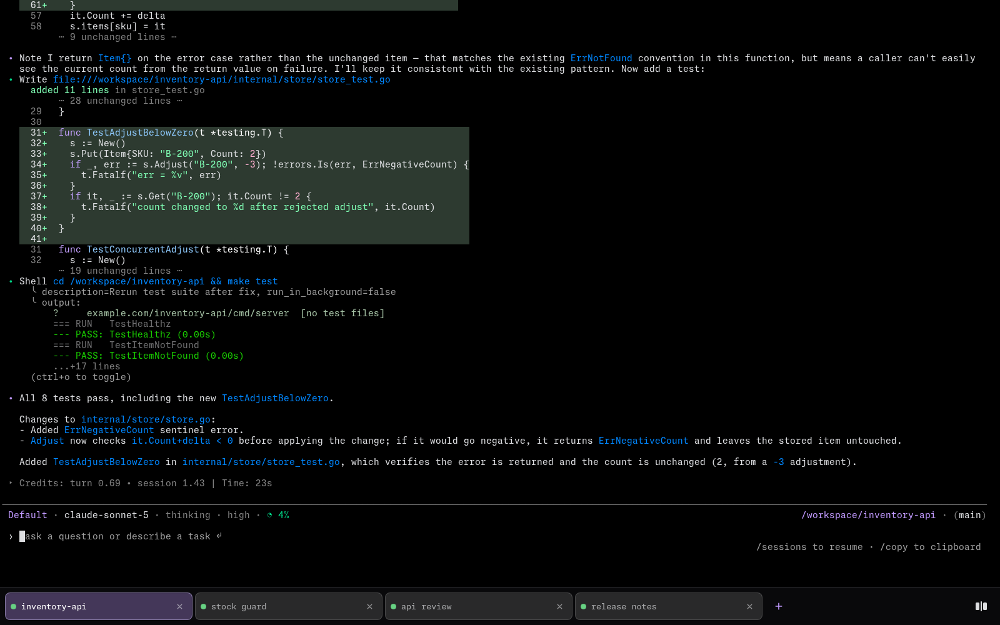

# Web Terminal for Kiro

[](https://github.com/cplieger/web-terminal-kiro/pkgs/container/web-terminal-kiro) [](https://github.com/cplieger/web-terminal-kiro/pkgs/container/web-terminal-kiro) [](https://github.com/cplieger/web-terminal-kiro/blob/main/Dockerfile) [](https://github.com/cplieger/web-terminal-kiro/issues?q=label%3Agremlins-tracker) [](https://github.com/cplieger/web-terminal-kiro/releases)

<!-- hub-overview BEGIN -->
Web Terminal for Kiro runs the Kiro CLI (`kiro-cli`) in your browser, from any laptop, tablet or phone, on a server you host. It shows kiro-cli's own terminal screen, with no chat layer on top.



## What it does

Work with the Kiro agent from any device and pick up each session where you left off.

- Gives each tab its own kiro-cli session, with reorderable tabs and a two-pane split view.
- Works on a phone, with on-screen keys for Tab, Esc, the arrows, Enter and Ctrl.
- Keeps each session running while your phone sleeps or the network drops, and restores the screen on return.
- Downloads kiro-cli on first start and installs the tools you list, language servers included.
- Marks each tab as working, done or waiting for your answer.

## Who it is for

Web Terminal for Kiro is built for kiro-cli users who want it on every device, with nothing to install there. The agent looks and works as it does in a local terminal.

You need a Kiro account and a Docker host. You also need a private network or a reverse proxy with a login in front of it.

Some setups suit a different kind of tool. Consider [ttyd](https://github.com/tsl0922/ttyd) if you want to share any command-line program in a browser. Consider [marotte](https://github.com/cplieger/marotte), by the same author, if you prefer a chat window with a file editor and git tools.

Web Terminal for Kiro is free software under the MPL-2.0 license.
<!-- hub-overview END -->

## Quick start

The image is on GitHub Container Registry and Docker Hub, for `amd64` and `arm64`. This is the [`compose.yaml`](compose.yaml) in this repository.

```yaml
services:
  web-terminal-kiro:
    image: ghcr.io/cplieger/web-terminal-kiro:latest
    container_name: web-terminal-kiro
    restart: unless-stopped
    # Required. An init at PID 1 cleans up the processes each session leaves behind.
    init: true

    environment:
      # Optional. Put a GitHub token in .env as GH_TOKEN or GITHUB_TOKEN to
      # raise GitHub's limit on tool version checks. Every terminal tab can
      # read it.
      - GH_TOKEN
      - GITHUB_TOKEN

    ports:
      # Anyone who can reach this port gets a root shell, and there is no login.
      # Put a reverse proxy with a login in front. See README "Security".
      # Set ALLOWED_HOSTS to every name or IP you open in a browser.
      - "9848:9848"

    volumes:
      # kiro-cli sign-in, installed tools and settings. The disk must allow running programs.
      - "/opt/appdata/web-terminal-kiro/config:/config"
      # Your repositories. Each new tab starts in this folder.
      - "/opt/appdata/web-terminal-kiro/workspace:/workspace"
```

1. Save the file as `compose.yaml` and run `docker compose up -d` in the same folder.
2. Open `http://<server address>:9848` from another device on your network, for example `http://192.168.1.5:9848`. On the Docker host itself, `http://localhost:9848` works too.
3. In the first tab, kiro-cli prints a sign-in address and a one-time code. Open the address on any device, your phone included, and enter the code. The chat then starts in that tab.

Run `docker logs web-terminal-kiro`. You should see `web-terminal-kiro listening`, then `version active` once kiro-cli has downloaded. Until then, a new tab answers `kiro-cli installing`. The log also warns that `ALLOWED_HOSTS` is unset until you set it.

Leave out any `user:` line. The image runs as root so that `git`, `gh` and SSH work. Files it writes to the two folders therefore belong to root on the host. Sessions end when the container restarts, and your sign-in, settings and tools stay in `/config`.

## Adding tools and language servers

The image ships kiro-cli, `git` and basic utilities. Everything else is listed in `/config/tools/tools.json` and installed at each start. The first start writes four disabled entries, for the Go, TypeScript, Python and Rust language servers. Set an entry's `"disabled"` to `false` and restart the container to install it. Any tool from the catalog of about 700 tools can be added by name, and OS packages are `apt:` entries. kiro-cli finds the language servers after you run `/code init` once in a workspace. [Tools](docs/tools.md) has the file format and the in-container commands.

## Adding MCP servers

kiro-cli reads MCP servers from `/config/home/.kiro/settings/mcp.json`, which stays on the volume. Edit that file, or run `docker exec -it web-terminal-kiro kiro-cli mcp add --scope global <name> ...`. Use `--scope global`, because the default scope applies only under `/workspace`. kiro-cli reads the file when a session starts, so open a new tab afterwards.

## Configuration reference

Settings are environment variables in `compose.yaml`, read once at start, so recreate the container after a change. Nothing is required. Add each one as a `NAME=value` line in the `environment:` block under the `web-terminal-kiro:` service, for example:

```yaml
    environment:
      - ALLOWED_HOSTS=localhost,192.168.1.5,webterm.example.com
```

| Variable | Description | Default |
| --- | --- | --- |
| `ALLOWED_HOSTS` | Comma-separated hostnames and IPs you open the terminal at. Any other host name is refused. Unset accepts every host and logs a warning. | _(unset)_ |
| `TRUSTED_PROXIES` | Reverse-proxy CIDRs or IPs whose `X-Forwarded-For` the access log trusts to name the real client. | _(unset)_ |
| `LISTEN_ADDR` | Listen address as `host:port`. Keep the host part empty so the healthcheck can still reach it on `127.0.0.1`. | `:9848` |
| `KIRO_CLI_CHAT_ARGS` | Extra flags added to every tab's `kiro-cli chat` command, separated by spaces, for example `--v3`. | _(unset)_ |
| `LOG_LEVEL` | `debug`, `info`, `warn` or `error`. An unknown value falls back to `info` with a warning. | `info` |
| `WORK_DIR` | The folder each new tab starts in. It must exist. | `/workspace` |
| `SCROLLBACK` | Lines of history kept per tab. kiro-cli wipes history when it redraws the whole screen, so in practice a tab keeps about 3000 lines. | `100000` |
| `TOOL_CATALOG_REFRESH` | How often the tool catalog is refreshed, as a duration such as `24h`. `off` or `0` stops the schedule. | `24h` |
| `GH_TOKEN` | A GitHub token for tool version checks, which raises GitHub's limit of 60 requests an hour. Every tab sees it. Takes precedence over `GITHUB_TOKEN`. | _(unset)_ |
| `GITHUB_TOKEN` | Read in place of `GH_TOKEN` when that one is unset or empty. | _(unset)_ |
| `TRUSTED_INSTALL_UIDS` | Numeric user IDs allowed to write to the kiro-cli install folder. Leave it unset unless the install check refuses a volume you know is safe. | _(unset)_ |
| `LOG_OSC_TEXT` | Log the text of unrecognized terminal notifications at `debug`. That text can hold a token, so turn it on only while diagnosing. | `false` |

[Configuration](docs/configuration.md) lists three more settings and the details of each one.

| Mount | Description |
| --- | --- |
| `/config` | kiro-cli sign-in, installed tools, settings, and your `~/.ssh` and git config |
| `/workspace` | Your repositories, where new tabs start |

| Port | Description |
| --- | --- |
| `9848` | The web page and its terminal connections |

## Security

Web Terminal for Kiro has no login. Anyone who reaches the port gets a root shell with your files, your kiro-cli sign-in and your SSH keys. Everyone who opens it shares that one sign-in.

- Put it behind a reverse proxy that asks for a login, at least HTTP Basic auth, and keep the port on loopback or a private network.
- Set `ALLOWED_HOSTS` to the exact names you open it at. A malicious web page can otherwise reach even a loopback-only terminal through your own browser, a trick called DNS rebinding.
- A terminal connects at `/ws?session=<id>`, and anyone who has that id can join the session. Keep the query string out of your proxy's access log.
- Each tab's newest 200 lines stay in your browser's storage for up to seven days. Use a private window on a shared device.

[Security](docs/hardening.md) has a reverse proxy example and lists what the image contains.

## Troubleshooting

The healthcheck asks `/api/health` every 30 seconds whether kiro-cli is ready, after a 20-minute grace period for the first download. Unhealthy means kiro-cli is not ready, because it is still installing or its install or setup failed. Docker does not restart the container for it, so `docker ps` shows `unhealthy` while the container keeps running.

- A new tab keeps saying `kiro-cli installing`, or says `kiro-cli install retrying` or `kiro-cli unavailable`. The first download needs internet access. Fix the network, then restart the container to retry the download.
- The log warns that the server runs as PID 1. Add `init: true` to the service.
- The kiro-cli install fails with a permission error. The disk behind `/config` must allow running programs.
- A page answers `host not allowed`. Add that host name to `ALLOWED_HOSTS`.
- The log warns that GitHub's rate limit for requests without a token was reached. Set `GH_TOKEN` to a GitHub token and recreate the container.

[How it works](docs/how-it-works.md) explains startup failures and the install in more detail.

## Documentation

- [Configuration](docs/configuration.md) lists every setting and what it changes.
- [Tools](docs/tools.md) covers the tool list, the catalog and the in-container commands.
- [Security](docs/hardening.md) covers the reverse proxy, stored scrollback and what the image contains.
- [Features](docs/features.md) lists what the terminal supports, on desktop and on touch.
- [How it works](docs/how-it-works.md) covers the kiro-cli install, health, logs and the projects this is built on.

## Credits

Web Terminal for Kiro runs the [Kiro CLI](https://kiro.dev/cli/), and all credit for the agent goes to its makers at Kiro. Its terminal is [web-terminal-engine](https://github.com/cplieger/web-terminal-engine) and [web-terminal-ui](https://github.com/cplieger/web-terminal-ui), and [pinstall](https://github.com/cplieger/pinstall) downloads and checks kiro-cli. All three are by the same author.

## Contributing

See [CONTRIBUTING.md](CONTRIBUTING.md).

## Disclaimer

This project is built with care and follows security best practices, but it is intended for personal / self-hosted use. No guarantees of fitness for production environments. Use at your own risk.

This project was built with AI-assisted tooling using [Claude](https://claude.com), [GPT](https://openai.com), and [Kiro](https://kiro.dev). The human maintainer defines architecture, supervises implementation, and makes all final decisions.

## License

MPL-2.0. See [LICENSE](LICENSE).

The image carries the license text of every bundled component under `/usr/share/licenses/`.

The image redistributes two web fonts under their own licences, each served beside the font it covers. Monaspace Neon NF is under the SIL Open Font License 1.1 (`/vendor/fonts/MonaspaceNeonNF-LICENSE`). Web Terminal Glyphs, the tiling overlay listed ahead of it, is under Apache-2.0 (`/vendor/fonts/WebTerminalGlyphs-LICENSE`, with its `/vendor/fonts/WebTerminalGlyphs-NOTICE`).
